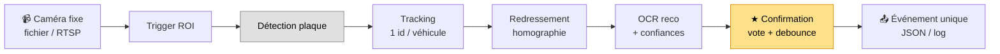
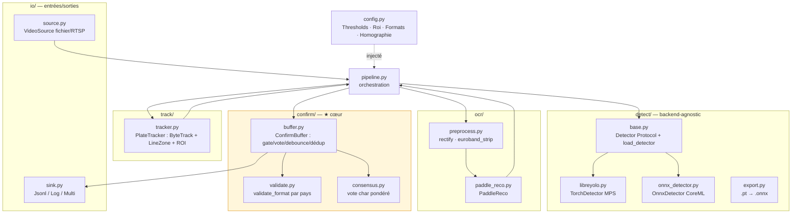
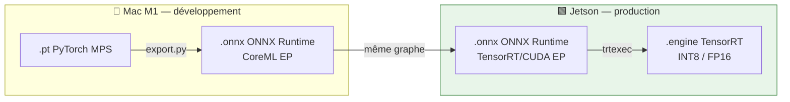

# 🧱 Architecture

[← Retour au README](../README.md) · [Pipeline →](PIPELINE.md) · [Problématiques →](PROBLEMATIQUES.md) · [Risques →](RISQUES.md) · [Roadmap →](ROADMAP.md)

---

## Sommaire

- [Vue d'ensemble](#vue-densemble)
- [Briques fonctionnelles](#briques-fonctionnelles)
- [Briques techniques](#briques-techniques)
- [Carte des modules](#carte-des-modules)
- [Principes de conception](#principes-de-conception)
- [Portabilité](#portabilité)

---

## Vue d'ensemble

Le système transforme un flux vidéo (caméra fixe) en **événements plaque**, à raison d'**un seul événement confirmé par véhicule**. Il n'émet jamais de lecture frame-par-frame : une plaque n'est publiée qu'après consensus sur plusieurs images du même véhicule.

> La brique **Détection** (grisée) est le seul maillon non encore entraîné — voir [Roadmap](ROADMAP.md).

---

## Briques fonctionnelles

Ce que le système *fait*, du point de vue métier.

| # | Brique | Responsabilité | Pourquoi elle existe |
|---|--------|----------------|----------------------|
| F1 | **Déclenchement (Trigger)** | Ne traiter que quand un véhicule entre dans la zone utile (ROI) et franchit la ligne | Économie CPU : la vue est fixe, le fond constant. Inutile d'analyser une route vide |
| F2 | **Localisation plaque** | Trouver la boîte de la plaque dans l'image | Un camion porte du texte partout (marque, pub, ADR) : on cible la plaque, pas « du texte » |
| F3 | **Suivi véhicule** | Attribuer un identifiant stable à chaque véhicule | Permet d'**agréger plusieurs lectures de la même plaque** — base du vote |
| F4 | **Redressement** | Ramener la plaque en quasi fronto-parallèle | La caméra voit la plaque de biais ; l'OCR lit mieux une plaque droite |
| F5 | **Nettoyage euroband** | Retirer la bande bleue UE (pays + étoiles) avant OCR | Sinon l'OCR lit « F », « D », « NL »… comme des caractères de la plaque |
| F6 | **Lecture (OCR)** | Transcrire la plaque + une confiance par caractère | Les confiances alimentent le vote pondéré |
| F7 | **Confirmation** | Décider *quand* et *quoi* émettre | ★ Le cœur métier : 90 % de la valeur (et des bugs) sont ici |
| F8 | **Publication** | Émettre l'événement final | Interface avec le reste du SI (fichier, log, plus tard file/DB) |

---

## Briques techniques

Comment chaque brique est *implémentée*. Choix figés — ne pas substituer sans raison licence/perf explicite.

| Rôle | Choix | Licence | Backend M1 | Module |
|------|-------|---------|------------|--------|
| Détection plaque | **LibreYOLO** (primaire) / **RF-DETR-S** (repli occlusion/angle) | MIT / Apache-2.0 | PyTorch MPS | [`detect/`](../anpr_poc/detect) |
| Tracking | **supervision** (ByteTrack + LineZone / PolygonZone) | MIT | CPU / numpy | [`track/`](../anpr_poc/track) |
| OCR reco | **PaddleOCR PP-OCRv5** (reconnaissance seule) | Apache-2.0 | CPU ou ONNX + CoreML | [`ocr/`](../anpr_poc/ocr) |
| Vision utils | **OpenCV** | Apache-2.0 | — | transverse |
| Config | **pydantic** + YAML/JSON | MIT | — | [`config.py`](../anpr_poc/config.py) |

> ⚠️ **RF-DETR** : rester sur `base`/`S`. Les variantes `XL`/`2XL` sont sous licence PML → interdites ici. Voir [Problématiques § licences](PROBLEMATIQUES.md#p3--contamination-de-licence-agpl).

---

## Carte des modules

Le fichier [`pipeline.py`](../anpr_poc/pipeline.py) est le seul point qui connaît toutes les briques ; chacune est isolée et testable séparément.

---

## Principes de conception

1. **Backend-agnostic dès le premier jour.** Le détecteur est un `Protocol` ([`detect/base.py`](../anpr_poc/detect/base.py)). `load_detector(weights, backend="auto")` choisit `torch` / `onnx` / `tensorrt` selon l'extension. Aucune ligne Mac-only dans le chemin d'inférence → le portage Jetson ne touche que le backend.

2. **Sans état global.** `ConfirmBuffer`, `PlateTracker` sont instanciés par run. L'eval crée un tracker neuf par clip → aucune fuite d'état entre clips.

3. **Config injectée, zéro seuil en dur.** `CONF_MIN`, `K_CONSENSUS`, ROI, homographie, regex par pays, fenêtre de dédup → tous dans [`config/`](../config), chargés via pydantic. Changer un seuil = éditer un YAML, pas le code.

4. **Déterministe.** Pas de VLM/LLM dans la boucle. Le seul « jugement » est un vote arithmétique + des regex — traçable et reproductible.

5. **Le cœur est isolé et testé.** Tout [`confirm/`](../anpr_poc/confirm) fonctionne sans aucun modèle (numpy pur) → 11 tests unitaires rapides couvrent la logique où vivent 90 % des bugs.

---

## Portabilité

- **Même code, backend commuté.** Le passage Mac → Jetson change l'exécuteur, pas la logique.
- **Export ONNX** ([`detect/export.py`](../anpr_poc/detect/export.py)) : shapes fixes, opset stable → conversion TensorRT simplifiée sur Jetson.
- **Wheels aarch64** depuis `pypi.jetson-ai-lab.io` (éviter la compilation manuelle des deps).
- **Refroidissement actif** requis sur Jetson pour charge soutenue.

⚠️ Ce portage est **prévu mais non commencé** — voir [Roadmap § Jalon 3](ROADMAP.md#jalon-3--portage-jetson).

---

[← README](../README.md) · [Pipeline →](PIPELINE.md)
