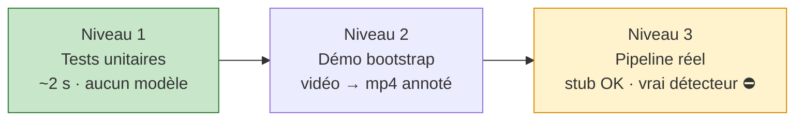

# 🧪 Guide de test

Comment vérifier que le système fonctionne — du test unitaire (2 s) à la démo sur vidéo réelle.

[← Installation](INSTALLATION.md) · [Retour README](../README.md) · [Pipeline](PIPELINE.md) · [Problématiques](PROBLEMATIQUES.md)

---

## Sommaire

- [Les 3 niveaux de test](#les-3-niveaux-de-test)
- [Niveau 1 — Tests unitaires du cœur](#niveau-1--tests-unitaires-du-cœur)
- [Niveau 2 — Démo bootstrap sur vidéo](#niveau-2--démo-bootstrap-sur-vidéo)
- [Niveau 3 — Pipeline réel](#niveau-3--pipeline-réel-bloqué)
- [Lire et interpréter les événements](#lire-et-interpréter-les-événements)
- [Régler les seuils](#régler-les-seuils)
- [Harnais d'évaluation (CER / FP / FN)](#harnais-dévaluation-cer--fp--fn)

---

## Les 3 niveaux de test



| Niveau | Vérifie | Prérequis | Durée |
|--------|---------|-----------|-------|
| 1 | La **logique de confirmation** + le **câblage** du pipeline | numpy+pydantic (+opencv pour l'intégration) | ~2 s |
| 2 | La **plomberie complète** (détecte→track→OCR→confirme→annote) | +paddleocr, +ffmpeg | ~1–3 min / 5 s de vidéo |
| 3a | Le **vrai `anpr_poc.run`** end-to-end (backend `stub`) | +paddleocr | selon durée clip |
| 3b | Le **système réel** avec vraies plaques | +détecteur entraîné | — |

---

## Niveau 1 — Tests unitaires du cœur

Le cœur (`confirm/`) est pur numpy → testable sans aucun modèle. C'est là que vivent 90 % des bugs, donc c'est le test le plus important.

```bash
python -m pytest tests/ -q
```

**Attendu :**
```
..................                                             [100%]
18 passed in 0.30s
```

Ce que ça couvre — cœur ([`tests/test_confirm.py`](../tests/test_confirm.py)) + intégration ([`tests/test_pipeline.py`](../tests/test_pipeline.py)) :

| Test | Garantit |
|------|----------|
| `test_vote_picks_majority_char` | Vote caractère majoritaire |
| `test_vote_filters_to_majority_length` | Filtrage à la longueur majoritaire |
| `test_vote_weights_by_confidence` | Pondération par confiance |
| `test_validator_fr_strict` | FR strict : rejette lecture partielle |
| `test_validator_fallback_for_unknown_country` | Fallback souple si pays inconnu |
| `test_validator_permissive_mode` | Mode permissif désactivable |
| `test_dedup_suppresses_same_plate_across_tracks` | Anti-doublon inter-tracks |
| `test_dedup_allows_same_plate_after_window` | Ré-émission après la fenêtre |
| `test_dedup_edit_distance_catches_near_miss` | Dédup quasi-doublon (distance ≤ 1) |
| `test_dedup_exact_only_when_distance_zero` | Dédup exact si seuil 0 |
| `test_require_crossing_blocks_until_crossed` | Gate franchissement de ligne |
| `test_retain_evicts_inactive_tracks` | Purge mémoire des tracks disparus |
| `test_buffer_emits_once_on_consensus` | Émission unique |
| `test_buffer_gate_rejects_low_confidence` | Gate qualité |
| `test_buffer_waits_for_k_consensus` | Debounce K |
| `test_pipeline_emits_one_event_after_consensus` | **Câblage bout-en-bout** (détecteur/OCR factices) |
| `test_pipeline_no_event_when_below_consensus` | Pas d'émission sous le seuil |
| `test_pipeline_rejects_invalid_format` | Format invalide rejeté end-to-end |

> Verbeux : `python -m pytest tests/ -v`

---

## Niveau 2 — Démo bootstrap sur vidéo

> La démo remplace le détecteur (non entraîné) par PaddleOCR en **détecteur de texte générique**. Elle valide toute la chaîne et produit une **vidéo annotée** + un **JSONL d'événements**. Ce ne sont pas encore de « vraies » plaques filtrées par un détecteur dédié — mais la plomberie, le tracking multi-plaque et la confirmation sont réels.

### 2.1 Préparer une vidéo

Placez un clip dans `data/clips/` (gitignoré). Sondez-le :
```bash
ffprobe -v error -select_streams v:0 \
  -show_entries stream=width,height,r_frame_rate,duration \
  -of default=noprint_wrappers=1 data/clips/mon_clip.mp4
```
Pour de bons résultats : **≥ 720p**, plaque **≥ 120 px** de large (cf. [Problématiques § P5](PROBLEMATIQUES.md#p5--résolution--flou-de-mouvement)).

### 2.2 Lancer

```bash
python -m demo.bootstrap_demo \
  --video data/clips/mon_clip.mp4 \
  --start-sec 0 --end-sec 5 \
  --every 1 \
  --conf 0.5 \
  --k 2 \
  --country FR \
  --out-video out/demo.mp4
```

| Option | Rôle | Défaut |
|--------|------|--------|
| `--video` | Clip d'entrée | `data/clips/volvo_test.mp4` |
| `--start-sec` / `--end-sec` | Fenêtre temporelle (`--end-sec 0` = jusqu'à la fin) | 0 / 0 |
| `--every N` | Traite 1 frame sur N (débit vs fluidité) | 4 |
| `--conf` | Seuil de score OCR pour garder une boîte | 0.6 |
| `--k` | `K_CONSENSUS` (lectures concordantes) | 3 |
| `--country` | Pays pour la validation format (`FR`/`GB`/`DE`…) | FR |
| `--dedup-sec` | Fenêtre anti-doublon | 5.0 |
| `--out-video` | Vidéo annotée de sortie | `out/volvo_annotated.mp4` |

### 2.3 Sortie attendue

Progression puis :
```
DONE frames=125 events=1 -> out/demo.mp4 / out/demo.events.jsonl
```
Deux fichiers :
- `out/demo.mp4` — vidéo annotée (boîte + `#id plaque` sur chaque véhicule, compteur `confirmed`) ;
- `out/demo.events.jsonl` — un événement par ligne.

### 2.4 Vérifier visuellement

Extraire une frame précise et l'ouvrir :
```bash
# frame n°78 de la vidéo annotée
ffmpeg -v error -i out/demo.mp4 -vf "select=eq(n\,78)" -vframes 1 out/frame78.jpg
open out/frame78.jpg
```
La boîte doit être **exactement sur la plaque**, label juste au-dessus (cf. [Problématiques § P9](PROBLEMATIQUES.md#p9--alignement-annotation--coordonnées-ocr)).

### 2.5 Résultats de référence (obtenus pendant le POC)

| Clip | Réglages | Résultat |
|------|----------|----------|
| Volvo 720p, camion de face (35–40 s) | `--country FR --k 2` | **1 événement** `GX-521-EW` (conf 0.99) |
| Autoroute 1080p, trafic dense (0–5 s) | `--country GB --every 1 --k 2` | **5 plaques UK** confirmées, jusqu'à 3 boîtes simultanées |
| Même Volvo en **360p** | idem | ❌ illisible — démontre l'exigence de résolution |

---

## Niveau 3 — Pipeline réel

### 3a. Avec le détecteur factice (tourne aujourd'hui)

Le vrai `anpr_poc.run` s'exécute **end-to-end** sans modèle entraîné, via le backend `stub` (boîte fixe + OCR PP-OCRv6 réel + tracking + confirmation) :
```bash
python -m anpr_poc.run data/clips/mon_clip.mp4 --backend stub --out out/events.jsonl
```
Utile pour valider le câblage réel (pas la démo), l'intégration OCR 3.x, le format de sortie. **Ne détecte pas vraiment les plaques** (boîte centrale factice) — c'est un test de plomberie, pas de qualité.

### 3b. Avec un vrai détecteur *(bloqué)*

```bash
python -m anpr_poc.run <video|rtsp> --weights weights/plate.onnx --out out/events.jsonl
```
⛔ **Nécessite un détecteur plaque entraîné** — non fourni (cf. [Risques § R1](RISQUES.md#r1--détecteur-plaque-non-entraîné-bloqueur)). Tant que `TorchDetector`/`OnnxDetector` sont des stubs, cette commande lève `NotImplementedError`. C'est le [Jalon 1](ROADMAP.md#jalon-1--détecteur-plaque-le-bloqueur) de la roadmap.

---

## Lire et interpréter les événements

Chaque ligne de `*.events.jsonl` :
```json
{"text": "GX-521-EW", "tracker_id": 3, "t": 37.48, "conf": 0.992}
```
| Champ | Sens |
|-------|------|
| `text` / `plate` | Plaque confirmée (après vote sur plusieurs frames) |
| `tracker_id` | Identifiant du véhicule (1 événement max par id) |
| `t` / `timestamp` | Horodatage (s depuis le début du clip) |
| `conf` | Confiance moyenne des lectures concordantes |

**Points de contrôle qualité :**
- **1 véhicule = 1 événement** → si vous en voyez 2 pour la même plaque, la fenêtre `--dedup-sec` est trop courte, ou la validation laisse passer une lecture partielle.
- **0 événement** alors qu'une plaque est visible → soit sous le seuil `--conf`, soit le format ne valide pas (mauvais `--country`), soit moins de `--k` lectures concordantes.
- **Plaque avec 1 caractère faux** → bruit OCR résiduel du mode bootstrap ; augmentez `--k`, ou attendez le vrai détecteur + redressement.

---

## Régler les seuils

Tous les seuils vivent dans [`config/`](../config) (jamais en dur). Pour la démo, ils sont aussi pilotables en CLI.

| Symptôme | Levier |
|----------|--------|
| Trop de faux événements | ↑ `--k` (plus de consensus), ↑ `--conf` (gate plus stricte) |
| Plaques manquées (pas assez de lectures) | ↓ `--k`, ↓ `--conf`, `--every 1` (toutes les frames) |
| Doublons pour un même véhicule | ↑ `--dedup-sec` |
| Mauvais pays validé | `--country` correct (le format strict rejette sinon) |
| Trop lent | ↑ `--every` (échantillonner), fenêtre `--start/--end` plus courte |

---

## Harnais d'évaluation (CER / FP / FN)

Pour mesurer objectivement sur une banque de clips étiquetés :

1. Renseigner la vérité-terrain — [`data/ground_truth.json`](../data/ground_truth.json) :
   ```json
   { "clip_001.mp4": "AB-123-CD", "clip_002.mp4": "GX-521-EW" }
   ```
2. Lancer (nécessite le détecteur du Niveau 3) :
   ```bash
   python -m eval.harness --clips data/clips --gt data/ground_truth.json --weights weights/plate.onnx
   ```
3. Sortie :
   ```
   clips=2 exact=100.00% CER=0.000 FP=0.00% FN=0.00%
   ```

| Métrique | Sens |
|----------|------|
| `exact` | Taux de plaques exactement correctes |
| `CER` | Character Error Rate (Levenshtein normalisé) |
| `FP` | Faux positifs : événement émis mais faux |
| `FN` | Faux négatifs : plaque attendue, aucun événement |

C'est cet harnais qui servira à **retuner les seuils** sur données réelles ([Roadmap Jalon 1](ROADMAP.md#jalon-1--détecteur-plaque-le-bloqueur)).

---

[← Installation](INSTALLATION.md) · [Retour README](../README.md)
