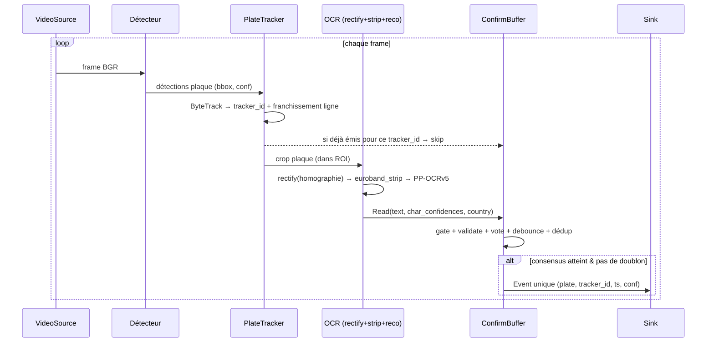
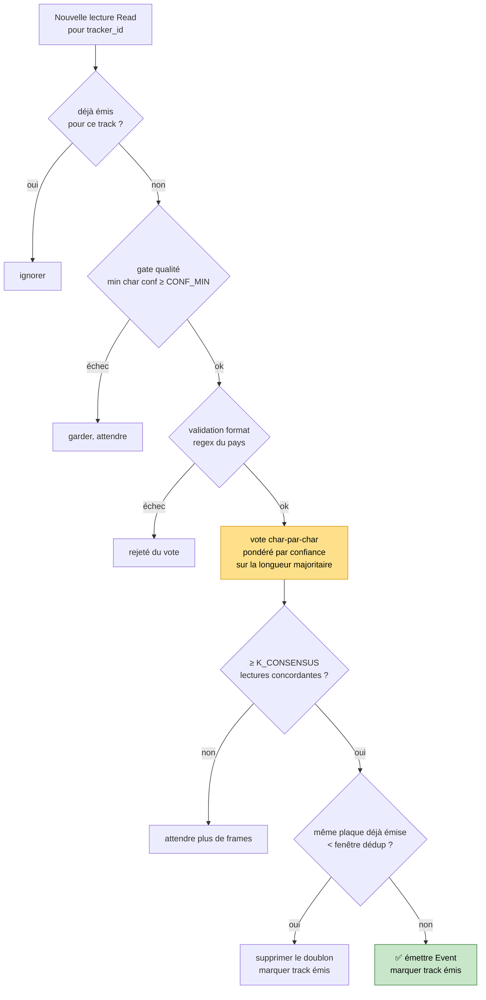

# 🔀 Pipeline & Workflow

[← Architecture](ARCHITECTURE.md) · [Retour README](../README.md) · [Problématiques →](PROBLEMATIQUES.md) · [Risques →](RISQUES.md) · [Roadmap →](ROADMAP.md)

---

## Sommaire

- [Le flux complet](#le-flux-complet)
- [Étape par étape](#étape-par-étape)
- [La logique de confirmation](#la-logique-de-confirmation) ★
- [Traitement multi-plaque](#traitement-multi-plaque)
- [Paramètres de configuration](#paramètres-de-configuration)

---

## Le flux complet

Orchestration : [`pipeline.py`](../anpr_poc/pipeline.py).

---

## Étape par étape

### 1. Déclenchement — ROI & ligne de franchissement
Vue fixe ⇒ fond constant. On ne traite que la zone utile (polygone ROI) et on détecte le franchissement d'une ligne (`supervision.LineZone`). Configuré dans [`config/roi.json`](../config/roi.json).

### 2. Détection plaque
Détecteur fine-tuné **sur la plaque** (pas de détection de texte générique). Sortie : boîtes + confiance. Backend commutable (`.pt`/`.onnx`/`.engine`). Seuil `det_conf_min`.

### 3. Tracking
`ByteTrack` attribue un `tracker_id` stable par véhicule. C'est ce qui permet d'**accumuler plusieurs lectures de la même plaque** pour voter. `PlateTracker.in_roi()` filtre les boîtes hors zone.

### 4. Redressement
`rectify(crop, homographie)` warpe le crop en quasi fronto-parallèle. L'homographie est **pré-calibrée une seule fois** (caméra fixe) et chargée depuis [`config/homographie.json`](../config/homographie.json). Identité = pas de redressement.

### 5. Nettoyage euroband
`euroband_strip(crop, frac=0.11)` retire ~11 % à gauche (bande bleue UE). Empêche l'OCR de lire la lettre-pays et les étoiles comme des caractères de plaque. Optionnel : `read_country_letter()` peut isoler la bande pour router la validation par pays.

### 6. OCR
`PaddleReco` (PP-OCRv5 reco seule) transcrit le crop nettoyé et rend une confiance. `det=False` : on ne redétecte pas de texte, la boîte vient déjà du détecteur dédié.

> 🟡 **Limite actuelle** : PP-OCRv5 rend un score *par ligne*, pas *par caractère*. On réplique le score sur chaque caractère (approximation). Pour du vrai par-caractère, il faut lire les logits CTC via l'export ONNX du modèle reco. Voir [Risques § R2](RISQUES.md#r2--confidences-ocr-par-caractère-approximées).

### 7. Confirmation ★
Voir section dédiée ci-dessous.

### 8. Publication
`Event` émis vers un ou plusieurs sinks (`JsonlSink`, `LogSink`, `MultiSink`). Un seul événement par `tracker_id`.

---

## La logique de confirmation

> C'est le cœur du système. [`confirm/buffer.py`](../anpr_poc/confirm/buffer.py) · [`confirm/consensus.py`](../anpr_poc/confirm/consensus.py) · [`confirm/validate.py`](../anpr_poc/confirm/validate.py)

### Les 5 filtres, dans l'ordre

1. **Gate qualité** — on ne garde que les lectures dont *tous* les caractères ont une confiance ≥ `CONF_MIN` (0.6). Élimine le bruit d'OCR faible.

2. **Validation format** — regex par pays (`dict pays → regex`). **Pas** un regex UE unique. Si le pays est connu (regex définie), la validation est **stricte** (`strict_when_known=True`) : pas de repli. Un pays inconnu retombe sur un fallback structurel souple. Exemple FR SIV : `^[A-Z]{2}-\d{3}-[A-Z]{2}$` → une lecture partielle `GX-521-E` est **rejetée**.

3. **Vote consensus** — `per_char_majority_vote` : on filtre à la longueur de texte majoritaire, puis à chaque position on choisit le caractère par **vote pondéré par la confiance**. Robuste aux lectures basse-confiance sans les jeter d'office.

4. **Debounce** — on n'émet que si **≥ `K_CONSENSUS`** (3) lectures concordent avec le candidat. Empêche d'émettre sur une seule bonne frame chanceuse.

5. **Anti-doublon inter-tracks** — si la même plaque a déjà été émise dans la fenêtre `dedup_window_sec` (5 s), on supprime le doublon. Gère la **fragmentation de tracking** (un véhicule que ByteTrack scinde en plusieurs `tracker_id`).

### Pourquoi cet ordre est important
Le format valide **avant** le vote : les lectures mal formées ne polluent pas le calcul de la longueur majoritaire ni le vote. Le dédup vient **en dernier**, sur le candidat déjà confirmé, pour ne pas re-suivre un identifiant rejeté.

> Ce comportement est verrouillé par [`tests/test_confirm.py`](../tests/test_confirm.py) (11 tests) : vote majoritaire, filtre longueur, pondération, gate, K-consensus, strict FR, fallback pays inconnu, dédup dans/hors fenêtre.

---

## Traitement multi-plaque

Le système est **multi-plaque par construction** : aucun code spécial n'est requis.

- `ByteTrack` renvoie **N boîtes par frame**, une par véhicule, chacune avec son `tracker_id`.
- `ConfirmBuffer` maintient **un buffer indépendant par `tracker_id`** (`dict[int, list[Read]]`). Chaque véhicule a son propre vote, son propre debounce, son propre état « émis ».
- Le dédup opère par **chaîne de plaque**, pas globalement : deux plaques différentes dans la même frame ne se gênent pas.

**Preuve terrain** : sur un clip d'autoroute (caméra fixe, 1080p), **5 plaques UK distinctes** ont été confirmées sur 5 secondes, jusqu'à **3 boîtes suivies simultanément** sur une même frame. Détail : [Problématiques § P7](PROBLEMATIQUES.md#p7--plusieurs-véhicules-simultanés).

---

## Paramètres de configuration

Tous dans [`config/`](../config), jamais en dur.

| Fichier | Paramètre | Défaut | Rôle |
|---------|-----------|--------|------|
| `thresholds.yaml` | `conf_min` | 0.6 | Gate qualité : confiance min par caractère |
| `thresholds.yaml` | `k_consensus` | 3 | Lectures concordantes requises avant émission |
| `thresholds.yaml` | `det_conf_min` | 0.4 | Seuil de confiance du détecteur plaque |
| `thresholds.yaml` | `euroband_strip_frac` | 0.11 | Fraction gauche croppée (euroband) |
| `thresholds.yaml` | `dedup_window_sec` | 5.0 | Fenêtre anti-doublon inter-tracks |
| `formats.yaml` | `default_country` | FR | Pays par défaut pour la validation |
| `formats.yaml` | `regex_by_country` | FR/GB/DE/ES/IT/NL/BE/PL | Regex de format par pays |
| `formats.yaml` | `strict_when_known` | true | Pays connu ⇒ strict, pas de fallback |
| `roi.json` | `polygon`, `line_*` | générique | Zone utile + ligne de franchissement |
| `homographie.json` | `matrix` | identité | Redressement pré-calibré |

---

[← Architecture](ARCHITECTURE.md) · [Problématiques →](PROBLEMATIQUES.md)
