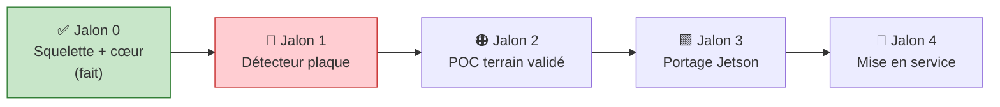

# ✅ Roadmap & TODO

Feuille de route par jalons. Cases à cocher — mettez à jour au fil de l'eau.

[← Risques](RISQUES.md) · [Retour README](../README.md) · [Architecture](ARCHITECTURE.md) · [Pipeline](PIPELINE.md) · [Problématiques](PROBLEMATIQUES.md)

---

## Vue d'ensemble des jalons

---

## ✅ Jalon 0 — Squelette + cœur *(terminé)*

- [x] Structure de dépôt backend-agnostic, config injectée
- [x] Cœur confirmation : buffer/tracker_id, gate, vote, debounce
- [x] Validation format par pays (FR/GB/DE/ES/IT/NL/BE/PL) + strict-when-known
- [x] Plaques canoniques (alphanumérique) → vote robuste aux séparateurs
- [x] Anti-doublon inter-tracks par **distance d'édition** (fenêtre configurable)
- [x] Gate optionnel de **franchissement de ligne** (`require_line_crossing`)
- [x] **Purge mémoire** des buffers de tracks disparus (`retain`)
- [x] Tracking multi-plaque (supervision ByteTrack + LineZone)
- [x] OCR PP-OCRv5/v6 **API 3.x** + `rectify()` + `euroband_strip()`
- [x] **`StubDetector`** → pipeline réel `anpr_poc.run` end-to-end (sans modèle entraîné)
- [x] Sinks événements (jsonl / log / multi)
- [x] Harnais eval (CER + FP/FN)
- [x] Export ONNX (chemin Jetson)
- [x] **18 tests** : cœur (`test_confirm`) + intégration (`test_pipeline`)
- [x] **CI** GitHub Actions : tests + contrôle de licences (aucune AGPL)
- [x] Démo bootstrap + rendu vidéo annoté
- [x] Documentation complète (ce dossier `docs/`)

---

## 🔴 Jalon 1 — Détecteur plaque *(le bloqueur)*

> Sans ça, aucune mesure de performance réelle. Cf. [Risques § R1](RISQUES.md#r1--détecteur-plaque-non-entraîné-bloqueur).

### Données
- [ ] Filmer **3–4 passages réels** depuis la position caméra définitive (ou proche)
- [ ] Pré-cropper via détection de texte générique (bootstrap) pour accélérer l'annotation
- [ ] Annoter **100–300 crops plaque** (boîtes)
- [ ] Étiqueter la **vérité-terrain plaque par clip** (`data/ground_truth.json`) pour l'eval

### Modèle
- [ ] Fine-tuner **LibreYOLO** (MIT) sur les crops plaque
- [ ] (Option repli) évaluer **RF-DETR-S** (Apache) si occlusion/angle difficiles
- [ ] Implémenter `TorchDetector._load` / `detect` ([`detect/libreyolo.py`](../anpr_poc/detect/libreyolo.py))
- [ ] Implémenter `OnnxDetector._preprocess` / `_postprocess` ([`detect/onnx_detector.py`](../anpr_poc/detect/onnx_detector.py))
- [ ] Exporter en ONNX et vérifier la parité de sortie torch ↔ onnx
- [ ] Brancher le détecteur réel dans `pipeline.py` (remplacer le bootstrap)

### Mesure
- [ ] Faire tourner `eval/harness.py` → **CER plaque** + **taux de faux événements**
- [ ] Retuner `conf_min`, `k_consensus`, `det_conf_min` sur données réelles ([R10](RISQUES.md#r10--seuils-empiriques-non-retunés))

---

## 🟠 Jalon 2 — POC terrain validé

### Qualité OCR
- [ ] Exporter le modèle reco en ONNX, lire les **logits CTC** → vraie confiance par caractère ([R2](RISQUES.md#r2--confidences-ocr-par-caractère-approximées))
- [ ] Rebrancher le vote pondéré sur les confiances par caractère réelles

### Calibration
- [ ] Calibrer l'**homographie** (4 points) sur la vue réelle → `config/homographie.json`
- [ ] Tracer **ROI + ligne de franchissement** réelles → `config/roi.json`
- [ ] Brancher le **trigger ROI** comme court-circuit CPU (ne traiter que si véhicule dans la zone) ([R3](RISQUES.md#r3--débit-temps-réel-non-profilé))

### Performance
- [ ] Fixer un **budget de latence** (fps cible, nb véhicules simultanés)
- [ ] Profiler le pipeline, activer ONNX + CoreML sur M1
- [ ] Vérifier le débit temps réel sur clip représentatif

### Robustesse
- [ ] Reconnexion / tolérance de panne du flux **RTSP** ([R6](RISQUES.md#r6--robustesse-du-flux-rtsp))
- [ ] Jeux de test **nuit / pluie / contre-jour** ([R7](RISQUES.md#r7--conditions-difficiles-non-testées))
- [ ] Migrer/épingler **ByteTrack** avant retrait v0.30 ([R9](RISQUES.md#r9--dépréciation-bytetrack-supervision))

### Conformité (à cadrer tôt)
- [ ] **RGPD** : base légale, information, durée de conservation, minimisation, DPIA si requise ([R5](RISQUES.md#r5--conformité-rgpd))
- [x] CI **contrôle de licences** (`pip-licenses`, échec si AGPL) ([R12](RISQUES.md#r12--contrôle-de-licences-non-automatisé))
- [ ] Durcir le contrôle : échouer aussi sur `UNKNOWN`, trancher les 2 deps LGPL ([R14](RISQUES.md#r14--deux-dépendances-lgpl--une-licence-unknown))
- [ ] Câbler le **routage par pays** (OCR lettre euroband → `Read.country`) ([R13](RISQUES.md#r13--routage-par-pays-non-câblé))

---

## 🟩 Jalon 3 — Portage Jetson

> Ne pas coder maintenant. Cf. [Architecture § portabilité](ARCHITECTURE.md#portabilité).

- [ ] Convertir ONNX → **TensorRT** (`trtexec`), INT8/FP16
- [ ] Implémenter le backend `tensorrt` dans `load_detector`
- [ ] Installer les wheels **aarch64** depuis `pypi.jetson-ai-lab.io`
- [ ] Valider la parité de résultats Mac ↔ Jetson (mêmes clips, même CER)
- [ ] Vérifier le **refroidissement actif** sous charge soutenue
- [ ] Mesurer le débit temps réel sur cible

---

## 🚀 Jalon 4 — Mise en service

- [ ] Persistance des événements (file de messages / DB / webhook) ([R8](RISQUES.md#r8--persistance-des-événements))
- [ ] Sécurité : identifiants caméra, chiffrement flux, protection snapshots ([R11](RISQUES.md#r11--sécurité-flux--stockage))
- [ ] Conteneurisation (Docker) + orchestration de déploiement
- [ ] Supervision : métriques (débit, taux d'émission, latence), alerting
- [ ] Rejeu / non-régression continue sur banque de clips étiquetés

---

## Idées / améliorations (backlog non planifié)

- [ ] OCR de la **lettre-pays** (euroband) pour router automatiquement la validation par pays
- [ ] Fusion multi-lectures avant/arrière d'un même véhicule
- [ ] Score de qualité d'image par crop (rejeter les crops trop flous en amont de l'OCR)
- [ ] Support formats plaques historiques (UK pré-2001, etc.)
- [ ] Interface de visualisation temps réel des événements

---

[← Risques](RISQUES.md) · [Retour README](../README.md)
